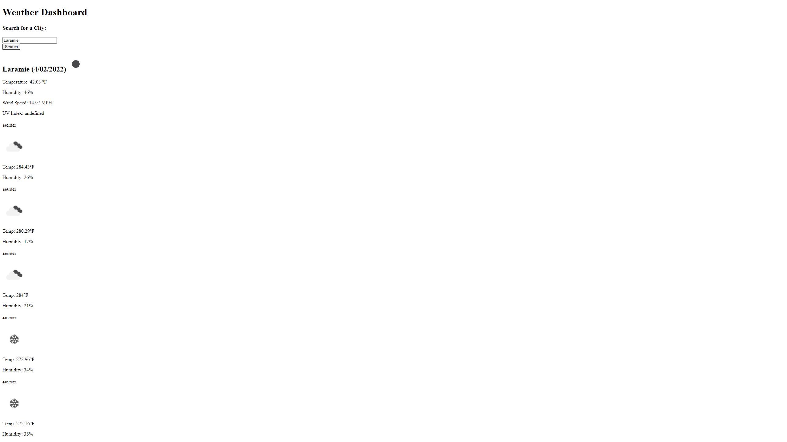

# Project
This weather dashboard application is designed to show the weather for a city of the users selection. Weather information includes current time-stamp, temperature, humidity, wind speed, and UV index. It also shows the weather for the next five days; with images for quickly gauging the temperature.

## Challenges and Lessons Learned
As with the the password generator there was an issue with a lack of planning prior to going into the weather dashboard which lead to multiple restructures and reformats before landing on a set path. Thanks again to Brennen Mazur for helping when I got stuck.

## To-do
Due to poor planning (again) and time constraints the dashboard is missing three minor, yet still important, aspects of the planned site. Those being local storage for previous searches, general styling for the page, and undefined UV Index numbers.

## Site
You can find the deployed site at: https://nikolasmazur.github.io/weather-dashboard/.

After hosting on GitHub Pages the site should look like this: 